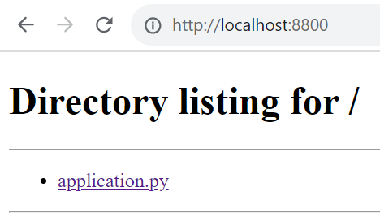

- [Get Started with Docker. Create a Docker Image](#get-started-with-docker-create-a-docker-image)
  - [Docker Image Definition](#docker-image-definition)
  - [Docker Container Definition](#docker-container-definition)
  - [Prerequisites](#prerequisites)
  - [Create the Directory Structure](#create-the-directory-structure)
  - [Build the Application Image](#build-the-application-image)
  - [Create and Test the Container](#create-and-test-the-container)
  - [Share the Docker Image](#share-the-docker-image)
  - [Related Articles](#related-articles)

# Get Started with Docker. Create a Docker Image

This tutorial contains step-by-step instructions on creating your first Docker image and container for a basic web server app written in Python.

This tutorial is for Linux users.

## Docker Image Definition

A Docker image provides an isolated filesystem to run the [container](#docker-container-definition). The image must contain everything needed to run your application — the operating system, all dependencies, configurations, scripts, binaries, etc. The image also contains configuration data for the container, such as environment variables, a default command to run, and other metadata.

## Docker Container Definition

A Docker container is a sandboxed process running on a host machine. A container:

* Is a runnable instance of an [image](#docker-image-definition).
* Can be run on local machines, virtual machines, or deployed to the cloud.
* Is portable and can be run on any OS.
* Is isolated from other containers and runs its own software, binaries, configurations, etc.

## Prerequisites

* You have installed the latest version of [Docker Desktop](https://docs.docker.com/get-docker/) or [Docker Engine](https://docs.docker.com/engine/install/).
* You have a text editor to edit files.

## Create the Directory Structure

1. Create the directories to store your application source code and Docker metadata:

    ```bash
    # Your project root
    mkdir quickstart_docker
    # Application source code
    mkdir quickstart_docker/application
    # Docker configuration files
    mkdir quickstart_docker/docker
    # Dockerfile location
    mkdir quickstart_docker/docker/application 
    ```

    !!! note
        This is a suggested directory structure to organize the Docker and application files. You can use a directory structure better suited for your project.

1. Go to the `quickstart_docker` directory. Replace `/path/to/quickstart_docker` with the path to your `quickstart_docker` directory:

    ```bash
    cd /path/to/quickstart_docker
    ```

1. Create the application file:

    ```bash
    touch application/application.py
    ```

1. Using a text or code editor, add the sample HTTP server Python code in the `application.py` file:

    ```python
    import http.server
    import socketserver
    import os

    # Listen to port 8800
    PORT = 8800

    # Serve files from the current directory
    # directly mapping the directory structure to HTTP requests
    Handler = http.server.SimpleHTTPRequestHandler

    # Create and listen at the HTTP socket, 
    # dispatching the requests to the handler.
    httpd = socketserver.TCPServer(("", PORT), Handler)

    # Echo current status to the console and server logs. 
    # It will be shown as the first line in the 'docker logs' command output.
    os.system(f"echo 'serving at port {PORT}'")

    # Handle requests until the server is terminated.
    httpd.serve_forever()
    ```

1. Create the `Dockerfile`:

    ```bash
    touch docker/application/Dockerfile
    ```

1. Add the following Docker image configuration in the `Dockerfile`:

    ```dockerfile
    # Use the base Python image from the Docker Hub
    FROM python:3.9

    # Set the working directory of the Docker container to '/app'. 
    # Any RUN, CMD, ADD, COPY, and ENTRYPOINT 
    # commands will be executed in the specified directory.
    WORKDIR /app

    # Copy the 'application' directory contents into the container at '/app'
    COPY ./application /app

    # Make port 8800 available to the world outside the container
    EXPOSE 8800

    # Execute 'python3 /app/application.py' when the container launches
    CMD ["python3", "/app/application.py"]
    ```

2. View the contents of the `quickstart_docker` directory, using the `tree` command. You should see the following structure:

    ```text
    └── quickstart_docker
        ├── application
        │   └── application.py
        └── docker
            └── application
                └── Dockerfile
    ```

## Build the Application Image

1. Build your application image using the `docker build` command:

    ```bash
    docker build . -f docker/Dockerfile -t exampleapp
    ```

    The `docker build` command above uses the following options:

    * `.` — use the current directory as the [build context](https://docs.docker.com/build/building/context/).
    * `-f` — specify the `Dockerfile` path: `docker/Dockerfile`.
    * `-t` — tag the image, giving it a human-readable name: `exampleapp`. You can refer to the image name when running the container.

1. View the image list:

    ```bash
    docker images
    ```
1. You should see the following:

    ```text
    REPOSITORY   TAG       IMAGE ID       CREATED       SIZE
    exampleapp   latest    22a44e06fe8d   1 minute ago  997MB
    ```

## Create and Test the Container

1. Create and run a container from your image:

    ```bash
        docker run --name server -p 128.0.0.1:8800:8800 -d exampleapp
    ```

    The `docker run` command above uses the following options:

    * `-p` — publish the container's port `8800` to `127.0.0.1:8800` (`localhost:8800`) on the host. Without this port mapping, you won't be able to access the application from the host.
    * `-d` — run the container in the background.
    * `--name server` — assign the name `server` to the container.
    * `exampleapp` — the name of the image to containerize.

1. You should see the container ID:

    ```text
    f7a6449f80ee87003e40ef7746fd102695c4910ee94906e0711f97ca1765068f
    ```

1. Open your web browser to http://localhost:8800. You should see the contents of the `/app` directory, served by the application in the container:

    

2. Stop the container:

    ```bash
    docker container stop server
    ```

## Share the Docker Image

In the next tutorial, we will show how to share your image to the Docker registry. The default registry is Docker Hub.

You can also read the official Docker guide on [sharing the image](https://docs.docker.com/get-started/04_sharing_app/).

## Related Articles

[Get Docker Desktop](https://docs.docker.com/get-docker/)

[Get Docker Engine](https://docs.docker.com/engine/install/)

[Dockerfile Reference](https://docs.docker.com/engine/reference/builder/)

[Docker Build Context](https://docs.docker.com/build/building/context/)

[Docker Command Line Reference](https://docs.docker.com/engine/reference/commandline/cli/)

[Sharing the Docker Image](https://docs.docker.com/get-started/04_sharing_app/)
